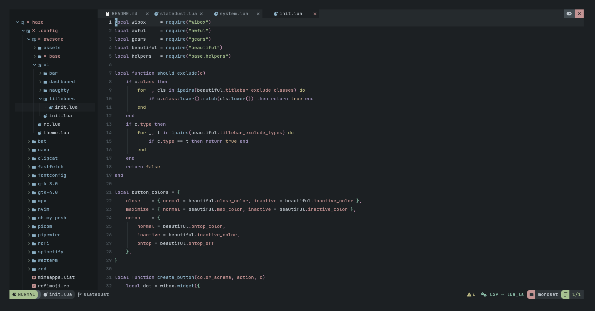

# slatedust.nvim

A dark Neovim colorscheme built around quiet focus.
Part of the [SlateDust](https://github.com/l0yst/slatedust) theme project.

## **Preview**



<p align="center">
  <a href="https://github.com/l0yst/slatedust.nvim/issues"></a><a href="https://github.com/l0yst/slatedust.nvim/blob/main/LICENSE"></a>
</p>

## Supports

- Treesitter
- LSP & diagnostics
- Telescope
- Gitsigns


## Install

**lazy.nvim**
```lua
{
    "l0yst/slatedust.nvim",
    priority = 1000,
    config = function()
        vim.cmd("colorscheme slatedust")
    end,
}
```
## NvChad

Copy `extras/nvchad/slatedust.lua` to `~/.config/nvim/lua/themes/slatedust.lua`

Then in `chadrc.lua`:
```lua
M.base46 = {
    theme = "slatedust",
}
```

## License

MIT — see [LICENSE](LICENSE)
